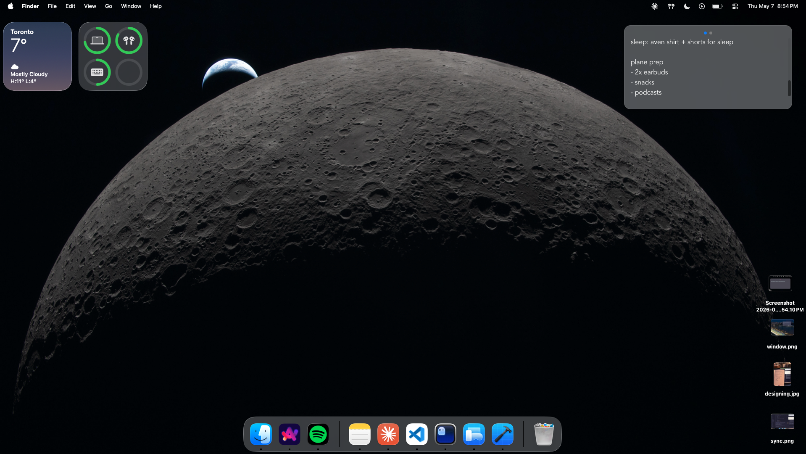

# noat

A minimalist, local-first note-taking app with realtime cross-device sync. Native desktop (Tauri) and mobile (Expo / React Native) clients share a SQLite-backed sync engine over Supabase. Meant to replace sending text messages to yourself, it's like Raycast Floating Notes w/ sync :)

> **Status: archived at v0.1.** noat was built between February and March 2026 as a learning project — cross-platform local-first sync, Tauri floating window UX, and Supabase realtime internals. It works end-to-end on macOS and iOS, and is no longer in active development. See [the retrospective on my blog](https://probablyalex.com/blog/wrapping-up-noat/) for what I learned.

<p align="center">
  
</p>

## What it does

A single notes pane, focused. No folders, no tags, no rich text. You get up to five notes per device, swipe between them, and they sync instantly across your devices.

- Multiple notes with horizontal swipe / scroll-snap navigation (capped at 5)
- Five color themes: paper, forest, ios, dark, cyberpunk
- Translucent, dock-less menubar window on macOS (accessory app)
- Global shortcut (`Option+/`) to toggle desktop window visibility
- Debounced autosave to local SQLite — works fully offline
- Realtime cloud sync via Supabase Postgres Changes (sub-100ms cross-device updates)
- Auto-deletion of notes older than 7 days in the trash

## Architecture

```
   ┌──────────────┐       ┌──────────────┐
   │   Desktop    │       │    Mobile    │
   │    Tauri     │       │  Expo / RN   │
   │  + SQLite    │       │  + SQLite    │
   └──────┬───────┘       └───────┬──────┘
          │                       │
          │   postgres_changes    │
          │   (realtime, <100ms)  │
          └───────────┬───────────┘
                      │
                ┌─────▼─────┐
                │ Supabase  │
                │  Postgres │
                └───────────┘
```

Each client is local-first: writes hit SQLite immediately and the UI never blocks on the network. A separate sync layer pushes dirty rows on a 1.5s debounce after autosave, and a Postgres Changes subscription pulls remote edits in realtime. Pull-on-focus reconciles anything missed while the app was backgrounded.

<p align="center">
  
</p>
<p align="center"><sub>Typing on the iPhone, desktop updating in realtime via Supabase postgres_changes.</sub></p>

The two clients share the Supabase client and shared types via the `@noat/sync` workspace package, but each owns its own SQLite layer (`expo-sqlite` is synchronous; Tauri's `plugin-sql` is async). The sync logic is intentionally parallel, not abstracted — the platform differences are small enough that abstraction would have cost more than it saved.

## Repo layout

```
apps/
  desktop/        Tauri (Rust + React + Vite) — macOS / Windows / Linux client
  mobile/         Expo (React Native) — iOS / Android client
packages/
  sync/           Shared Supabase client, types, and integration tests
```

Each app has its own `CLAUDE.md` with detailed architecture notes. The root `CLAUDE.md` documents shared conventions and the sync architecture's sharper edges.

## Tech stack

- **Frontend**: React 19, TypeScript (`strict: true`)
- **Desktop**: Tauri 2 (Rust), Vite, `@tauri-apps/plugin-sql`
- **Mobile**: Expo SDK 54, React Native 0.81, `expo-sqlite`, expo-router
- **Sync**: Supabase Postgres Changes (realtime) + REST
- **Tooling**: npm workspaces, Prettier, ESLint, husky + lint-staged, Vitest

## Development

```bash
npm install
```

### Desktop (Tauri)

```bash
npm run desktop          # full Tauri app — Rust + Vite, Option+/ shortcut active
npm run desktop:web      # web frontend only — fast iteration on UI without Rust
```

First Rust build takes a few minutes; subsequent builds are super fast.

### Mobile (Expo)

```bash
npm run mobile           # Metro bundler — connect via dev build (not Expo Go)
```

The mobile app uses native modules (expo-sqlite, reanimated, live-markdown), so it requires a custom dev build — Expo Go won't load it. Build it once with:

```bash
cd apps/mobile
npx expo run:ios               # iOS simulator
npx expo run:ios --device      # connected iPhone via USB
npx expo run:android           # Android (emulator or device)
```

### Tests

```bash
npm test                 # sync integration tests (Vitest)
```

### Quality

```bash
npm run typecheck        # tsc across all workspaces
npm run lint             # ESLint across all workspaces
npm run format           # Prettier auto-format
```

## Configuration

Supabase credentials are committed in `packages/sync/src/supabase.ts` (anonymous client, public anon key — fine for a personal project). To point at your own Supabase instance, replace those constants and apply this schema to a `notes` table with RLS allowing `user_id` filtering. Realtime requires `REPLICA IDENTITY FULL` on the table — see the architecture notes in `CLAUDE.md` for why.

## Why it's archived

noat hit the goals I set for it: cross-platform architecture, a real Tauri app with native macOS integration, and Supabase realtime end-to-end. The next steps would have been auth, a real backend with RLS, polish, distribution, and I realized Apple Notes / DMing yourself is sufficient for 99% of people already, so I switched to working on other projects.

If you want the technical retrospective and to learn more about the process — read [the wrap-up post on my blog](https://probablyalex.com/blog/wrapping-up-noat/).

## License

[MIT](./LICENSE)
